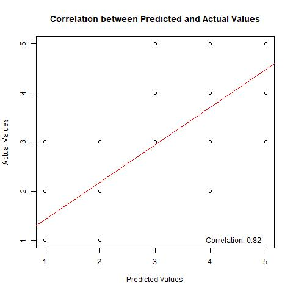
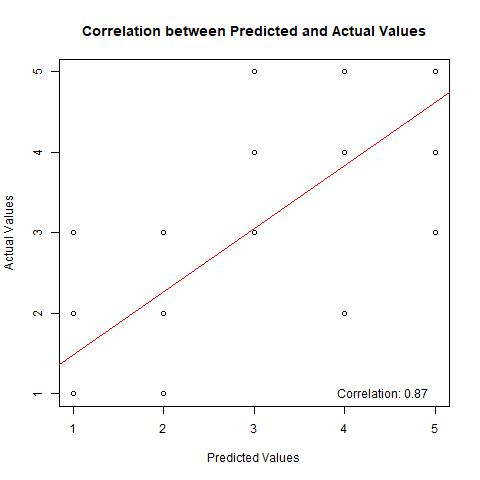

```{r setup, include=FALSE}
knitr::opts_chunk$set(echo = TRUE)
```

This is the markdown for our attempts to predict the likelihood of foreclosure at the tract level using logistic regression.

## Data Setup

Load libraries.

```{r setup, include=FALSE}
knitr::opts_chunk$set(echo = TRUE)
options(scipen=999)
##install.packages("ggrepel")
##install.packages('ggthemes')
##install.packages('aod')
##install.packages('caret')
##install.packages("MASS")
##install.packages("mice")
##install.packages("pdp")
library(tidyverse)
#Necessary for date parsing.
library(lubridate)
#Necessary for column name cleaning.
library(janitor)
#Eventually necessary for visualization
library(ggthemes)
#Necessary for Census API calls.
library(tidycensus)
#Eventually necessary for visualizations.
library(ggplot2)
#Potentially necessary for cleaning.
library(ggrepel)
#Eventually necessary for visualizations.
library(tigris)
#Simple features.
library(sf)
#Eventually necessary for mapping.
library(ggmap)
#Needed for logistic regression
library(aod)
#Needed for splitting into training and test datasets
library(caret)
#Needed for ordinal logistic regression
library(MASS)
#Needed for imputing missing values (using predictive mean matching)
library(mice)
#Needed for visualizing a partial dependence plot
library(pdp)
#Needed for naive bayes classification
library(e1071)
```

We read in our cleaned and combined dataset.

```{r}
# Read in the initial dataset, setting a guess_max limit to improve the accuracy of the data types assigned to each column.
pg_foreclosures_per_tract <- read_csv("datasets/pg_foreclosures_per_tract.csv", guess_max = 173)
```
 to create a classification algorithm, we need to create an ordinal variable -- our response variable -- using the quantiles of the foreclosure_pc_2020 variable -- our original dependent variable. We can also create a column based on the quantiles that splits the data into two groups: the top 2 quantiles and the bottom 3 quantiles.

```{r}
# Create a new column "foreclosure_quantile" based on quantiles of foreclosure_pc_2020
pg_foreclosures_per_tract_log_reg <- pg_foreclosures_per_tract %>%
    mutate(foreclosure_quantile = ntile(foreclosure_pc_2020, 5),
         high_or_low_foreclosure = case_when(
           foreclosure_quantile %in% c(1, 2, 3) ~ 0,
           foreclosure_quantile %in% c(4, 5) ~ 1,
         ))
```

To create an initial model, we start by dividing our data into training and test sets. We use 70% of the rows for the training set and 30% for the test set.

```{r}
# Set the seed for reproducibility
set.seed(123)

# Split the data into 70% training and 30% test sets
train_index <- createDataPartition(pg_foreclosures_per_tract_log_reg$foreclosure_quantile, p = 0.7, list = FALSE)

# Create training and test sets
train_data <- pg_foreclosures_per_tract_log_reg[train_index, ]
test_data <- pg_foreclosures_per_tract_log_reg[-train_index, ]

# Check the dimensions of training and test sets to ensure they have the appropriate number of columns
dim(train_data)
dim(test_data)
```
To avoid collinearity when choosing variables for our model, we need to check whether any of our independent variables are closely correlated with one another. If so, we will not use both in a single model.

We should also check the ranges of our numeric variables to be sure there are no infinite values. This step also allows us to isolate collinear values.
```{r}
# Check data range for numeric variables
numeric_vars <- train_data[sapply(train_data, is.numeric)]
data_range <- sapply(numeric_vars, function(x) c(min = min(x, na.rm = TRUE), max = max(x, na.rm = TRUE)))
print("Data Range:")
print(data_range)

# Check for infinite values in numeric variables
infinite_values <- colSums(sapply(numeric_vars, is.infinite))
print("Infinite Values:")
print(infinite_values)

# Check for collinear variables (using correlation matrix)
correlation_matrix <- cor(numeric_vars)
highly_correlated <- findCorrelation(correlation_matrix, cutoff = 0.8)
print("Highly Correlated Variables:")
print(colnames(numeric_vars)[highly_correlated])
```
Using a correlation coefficient threshhold of 0.7, we find six sets of highly correlated variables.

Based on that information, we can surmise that our model will be more functional if we do not include combinations/multiple variations of the following in our model:

1. Mortgage/owner-occupied percentage variables
2. Absolute median income variables.
3. The change in mortgage percentage from 2010 to 2020 variable and the non-Hispanic white population in 2020 variable.
4. Change in owner occupied percentage variables.

We can visualize collinearity using a scatterplot matrix, but we should only plot smaller subsets of independent variables at a time to ensure readability. For the sake of space, we won't plot every possible combination -- only a small subset for demonstration purposes.

```{r}
# Create scatterplot matrix
pairs(train_data[, c("avg_bed", "tract_homevalue_2020", "tract_medage_2020", "tract_medincome_2020", 
                            "tract_medincome_2010", "foreclosure_pc_2010", 
                            "pct_built_2020_later")])
```
From our previous analyses, we also know that the following variables/groups of variables most strongly correlate with foreclosure_pc_2020:

1. foreclosure_pc_2010
2. mortgaged_2010/2015/2020
3. own_occupied_2010/2015/2020
4. tract_medage_2020
5. pct_0_bd/pct_1_bd/pct_2_bd/pct_4_more_bed
6. poverty_2010/2020
9. tract_medincome_2010/2020
10. avg_bed


With that in mind, we can begin testing models. Because our response variable is ordinal rather than binary, we will use a proportional odds logistic regression formula.

The combination of variables from the *linear regression section* of this milestone that produced the most predictive model do not work in this case -- evidently, two of our initial variables, tract_homevalue_2020 and medincome_2020, were too closely correlated with mortgaged_2010. 

mortgaged_2010 was more predictive in the linear regression section, so we keep that variable and drop the other two. The following is our initial model:

```{r}
train_data$foreclosure_quantile <- factor(train_data$foreclosure_quantile)

# Use the training dataset for model fitting
model_1 <- polr(foreclosure_quantile ~ mortgaged_2010 + tract_medage_2020 + foreclosure_pc_2010 + pct_built_2000_2009 + poverty_2010 + nhwhite_2020 + mortgage_change_2010_2020 + poverty_change_2010_2020 + nhwhite_change_2010_2020 + medincome_change_2010_2015 + medincome_change_2015_2020 + medincome_change_2010_2020 + pop_change_pct, data = train_data, Hess = TRUE)

# Summarize the model
summary(model_1)
```

We also need to calculate the odd ratios for this model.
```{r}
# Extract coefficients
coefficients <- coef(model_1)

# Calculate odds ratios
odds_ratios <- exp(coefficients)

# Display the results
result <- data.frame(
  Predictor_Variable = names(coefficients),
  Odds_Ratio = odds_ratios
)

print(result)
```

We will treat the residual deviance/AIC of that model as a base for evaluating other models.

Instead, we will test a first model that includes only variables that use the whole tract population as the sample/denominator, including our single most predictive variable -- foreclosure_pc_2010, which represents the number of foreclosures per capita in a tract during the height of the great recession (2008-2010). We also use the median age in 2020 and poverty in 2010 variables, which are both highly predictive.


```{r}
# Convert foreclosure_quantile to factor to make the thing run (not really sure why I need to specify this, but it's the only thing that worked)
train_data$foreclosure_quantile <- factor(train_data$foreclosure_quantile)

# Use the training dataset for model fitting
model_2 <- polr(foreclosure_quantile ~ foreclosure_pc_2010 + tract_medage_2020 + poverty_2010, data = train_data, Hess = TRUE)

# Summarize the model
summary(model_2)
```
In this model, the foreclosure_pc_2010 variable is the most predictive, and the poverty_2010 variable is the least predictive. It is less predictive than our initial model


We can also try adding other (less predictive) variables that use the whole tract population as a sample/denominator, including the percentage of the population claiming non-Hispanic white ancestry in the 2016-2020 ACS and the change in reported median household incomes from the 2006-2010 ACS to the 2016-2020 ACS and the population change during the same period.

```{r}
# Convert foreclosure_quantile to factor
train_data$foreclosure_quantile <- factor(train_data$foreclosure_quantile)

# Use the training dataset for model fitting
model_3 <- polr(foreclosure_quantile ~ foreclosure_pc_2010 + tract_medage_2020 + poverty_2010 + nhwhite_2020 + medincome_change_2010_2020, data = train_data, Hess = TRUE)

# Summarize the model
summary(model_3)
```
Those additions to the model improve its fit to some degree, but not enormously. It improves the predictive power of the tract_medage_2020 variable and poverty_2010 variable to some degree, but the nhwhite_2020 variable becomes more predictive than the povert_2010 variable. The medincome_change_2015_2020 is the least predictive by a long shot.

We can try a different approach using housing characteristic/home ownership characteristic variables. We start with the housing/home ownership variables that had the strongest correlations with the foreclosure_pc_2020 variable during our initial analysis.

```{r}
# Use the training dataset for model fitting
model_4 <- polr(foreclosure_quantile ~ avg_bed + mortgaged_2010 + pct_1_bd, data = train_data, Hess = TRUE)

# Summarize the model
summary(model_4)
```
This model is less predictive than our first attempt, and the mortgaged_2010 variable is the most predictive of the three.

We can try adding other housing-specific variables before we combine the two approaches. Here, we add the percentage of units built pre-1960 and between 2000-2009 to the model, as well as the change in the percentage of homes with mortgages between the 2006-2010 and 2016-2020 ACS. 

```{r}
# Use the training dataset for model fitting
model_5 <- polr(foreclosure_quantile ~ avg_bed + mortgaged_2010 + pct_1_bd + pct_built_pre_1960 + pct_built_2000_2009 + mortgage_change_2010_2015, data = train_data, Hess = TRUE)

# Summarize the model
summary(model_5)
```
Those additions barely improve the fit of the model, and mortgated_2010 remains the most predictive variable.

We can now test whether combining the population- and housing-centered models creates the most predictive model thus far. 

```{r}
# Use the training dataset for model fitting
model_6 <- polr(foreclosure_quantile ~ foreclosure_pc_2010 + tract_medage_2020 + poverty_2010 + nhwhite_2020 + medincome_change_2010_2020 + avg_bed + mortgaged_2010 + pct_1_bd + pct_built_pre_1960 + pct_built_2000_2009 + mortgage_change_2010_2015 + pop_change_pct, data = train_data, Hess = TRUE)

# Summarize the model
summary(model_6)
```
This model is only slightly less predictive than our initial model. Surprisingly, the percentage of residents in a tract claiming non-Hispanic white ancestry is the most predictive variable in this model. 


We can also calculate the odds ratio for each variable in this model. 

```{r}
# Define coefficients
coefficients <- coef(model_6)

# Calculate odds ratios
odds_ratios <- exp(coefficients)

# Display the results
result <- data.frame(
  Predictor_Variable = names(coefficients),
  Odds_Ratio = odds_ratios
)

print(result)
```
The odds ratio figures suggest that a single-unit shift in the percentage of homes with a mortgage as of the 2006-2010 ACS would increase the odds of transitioning to a higher foreclosure per capita quantile by a factor of 604.886 - wow!


Because our first model appeared to be most predictive, will first run our test with our initial model. 

We can now test that model on our test set.

We can first calculate the correlation between the quantile values predicted by our model and the actual quantile values of our data.

```{r}
# Open a jpeg device to save the plot
jpeg("correlation_plot_log_reg_model_1.jpg")

# Predict values using the model and test data
predicted_values <- predict(model_1, newdata = test_data, type = "class")

# Calculate the correlation between predicted and actual values
correlation <- cor(as.numeric(predicted_values), test_data$foreclosure_quantile)

# Plot the correlation using a scatter plot
plot(as.numeric(predicted_values), test_data$foreclosure_quantile,
     xlab = "Predicted Values", ylab = "Actual Values",
     main = "Correlation between Predicted and Actual Values")
abline(lm(test_data$foreclosure_quantile ~ as.numeric(predicted_values)), col = "red")
text(x = max(as.numeric(predicted_values)), 
     y = min(test_data$foreclosure_quantile), 
     labels = paste("Correlation:", round(correlation, 2)), pos = 2)

# Close the jpeg device to save the plot
dev.off()

# Show the plot in Markdown

```
A correlation coefficient of 0.82 is not bad, but we are only dealing with five quantiles - we could use a better sense of how accurate this model is.


We can also see what percentage of the predicted quantiles match the actual quantiles.

```{r}
# Predict on test data
predictions <- predict(model_1, newdata = test_data, type = "class")

# View the predictions
print(predictions)
```
To test the accuracy of those predictions, we need to compare them to the corresponding foreclosure_quantile values in the test_data dataframe.

```{r}
# Extract the actual values from test_data
actual_values <- test_data$foreclosure_quantile

# Compare predicted values with actual values
comparison <- data.frame(Actual = actual_values, Predicted = predictions)

# Count the number of matching rows
matching_rows <- sum(comparison$Actual == comparison$Predicted)

# Calculate the total number of rows
total_rows <- nrow(comparison)

# Calculate the percentage of matching rows
matching_percentage <- (matching_rows / total_rows) * 100

# Print the percentage
cat("Percentage of matching rows:", matching_percentage, "%\n")
```
It appears that this model only correctly predicts the foreclosure per capita quantile at the tract level 54 percent of the time.


With that result in mind, we can also test our fifth model.

```{r}
# Open a jpeg device to save the plot
jpeg("correlation_plot_log_reg_model_6.jpg")

# Predict values using the model and test data
predicted_values <- predict(model_6, newdata = test_data, type = "class")

# Calculate the correlation between predicted and actual values
correlation <- cor(as.numeric(predicted_values), test_data$foreclosure_quantile)

# Plot the correlation using a scatter plot
plot(as.numeric(predicted_values), test_data$foreclosure_quantile,
     xlab = "Predicted Values", ylab = "Actual Values",
     main = "Correlation between Predicted and Actual Values")
abline(lm(test_data$foreclosure_quantile ~ as.numeric(predicted_values)), col = "red")
text(x = max(as.numeric(predicted_values)), 
     y = min(test_data$foreclosure_quantile), 
     labels = paste("Correlation:", round(correlation, 2)), pos = 2)

# Close the jpeg device to save the plot
dev.off()

# Show the plot in Markdown

```
That model is, for some reason, better at predicting quantiles than our initial model.

We can also test the one-for-one prediction accuracy of this model as another point of comparison.

```{r}
# Predict on test data
predictions_model_6 <- predict(model_6, newdata = test_data, type = "class")

# View the predictions
print(predictions)
```
To test the accuracy of those predictions, we need to compare them to the corresponding foreclosure_quantile values in the test_data dataframe.

```{r}
# Extract the actual values from test_data
actual_values <- test_data$foreclosure_quantile

# Compare predicted values with actual values
comparison <- data.frame(Actual = actual_values, Predicted = predictions_model_6)

# Count the number of matching rows
matching_rows <- sum(comparison$Actual == comparison$Predicted)

# Calculate the total number of rows
total_rows <- nrow(comparison)

# Calculate the percentage of matching rows
matching_percentage <- (matching_rows / total_rows) * 100

# Print the percentage
cat("Percentage of matching rows:", matching_percentage, "%\n")
```


!!Naive Bayes!!: 


To start, we divide the pg_foreclosures_per_tract_log_reg dataframe into training and test sets.


```{r}
set.seed(123) # For reproducibility
test_percent <- 0.2
indices <- sample(1:nrow(pg_foreclosures_per_tract_log_reg), 
                  size = round(test_percent * nrow(pg_foreclosures_per_tract_log_reg)))

train_data_2 <- pg_foreclosures_per_tract_log_reg[-indices, ]
test_data_2 <- pg_foreclosures_per_tract_log_reg[indices, ]
```

We can now train the Naive Bayes model using the same set of independent variables from the fifth proportional odds logistic regression model.

```{r}
#Train Naive Bayes Model

# Fit the Naive Bayes model
naive_bayes_model <- naiveBayes(foreclosure_quantile ~ nhwhite_2020 + 
                                  foreclosure_pc_2010 + 
                                  tract_medage_2020 + 
                                  poverty_2010 + 
                                  medincome_change_2010_2020 + 
                                  avg_bed + 
                                  mortgaged_2010 + 
                                  pct_1_bd + 
                                  pct_built_pre_1960 + 
                                  pct_built_2000_2009 + 
                                  mortgage_change_2010_2015 +
                                  pop_change_pct, data = pg_foreclosures_per_tract_log_reg)

# Summary of the model
summary(naive_bayes_model)
```

We can now use the Naive Bayes model to make predictions using our test data.

```{r}
# Predict using the Naive Bayes model
predictions <- predict(naive_bayes_model, newdata = test_data_2)

# Create the confusion matrix
confusion_matrix <- confusionMatrix(predictions, factor(test_data_2$foreclosure_quantile, levels = 1:5))

# Print the confusion matrix
print(confusion_matrix)
```
This output shows that the classifier has an overall accuracy of 45.71%. That is not a strong model, but it is significantly better than the No Information Rate (28.57%). However, the classifier's performance varies across quantiles, with higher accuracy for quantile 1, 3, and 5, less accuracy for quantile 2, and no accuracy for quantile 4. 

Overall, this model is less strong than the original proportional odds logistic regression model.


!! Laplace Estimator !!


We now need to retrain the Naive Bayes model using a LaPlace estimator. 
```{r}
# Train Naive Bayes Model with Laplace estimator

# Fit the Naive Bayes model with Laplace smoothing
naive_bayes_model_laplace <- naiveBayes(foreclosure_quantile ~ nhwhite_2020 + 
                                           foreclosure_pc_2010 + 
                                           tract_medage_2020 + 
                                           poverty_2010 + 
                                           medincome_change_2010_2020 + 
                                           avg_bed + 
                                           mortgaged_2010 + 
                                           pct_1_bd + 
                                           pct_built_pre_1960 + 
                                           pct_built_2000_2009 + 
                                           mortgage_change_2010_2015 +
                                           pop_change_pct, 
                                       data = pg_foreclosures_per_tract_log_reg,
                                       laplace = 1)

# Summary of the model with Laplace estimator
summary(naive_bayes_model_laplace)
```
Now that we have trained the model, we can use it to predict results. 

```{r}
# Predict using the Naive Bayes model
predictions <- predict(naive_bayes_model_laplace, newdata = test_data_2)

# Create the confusion matrix
confusion_matrix <- confusionMatrix(predictions, factor(test_data_2$foreclosure_quantile, levels = 1:5))

# Print the confusion matrix
print(confusion_matrix)
```
Given that all of the categories (quantiles) appear in our training and test data sets, it is unsurprising that the Laplace estimator, which is meant to ensure that categories that do not appear in the training data are still assigned a non-zero probability, does not have an impact on the accuracy of our Naive Bayes model.

